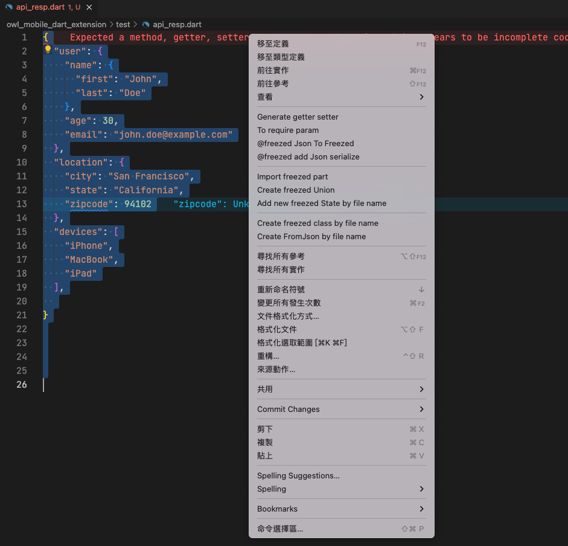

# Feature
* [Snippets Menu](./doc/snippets.md)
* [Right click Menu](./doc/menu_right_click.md)

## Convert selected json to freezed code 

  + Right click Menu => @freezed json to freezed
  + auto run build_runner 

### Before 



### After

* Base file name will set as json class Name

```dart
import 'package:freezed_annotation/freezed_annotation.dart';
part 'api_resp.g.dart';
part 'api_resp.freezed.dart';

@freezed
class ApiResp with _$ApiResp {
	const ApiResp._();
	const factory ApiResp({
		final User? user,
		final Location? location,
		@Default([]) final List<String> devices,
	}) = _ApiResp;
	factory ApiResp.fromJson(Map<String, dynamic> json) => _$ApiRespFromJson(json);
}

@freezed
class Location with _$Location {
	const Location._();
	const factory Location({
		final String? city,
		final String? state,
		final int? zipcode,
	}) = _Location;
	factory Location.fromJson(Map<String, dynamic> json) => _$LocationFromJson(json);
}

@freezed
class User with _$User {
	const User._();
	const factory User({
		final Name? name,
		final int? age,
		final String? email,
	}) = _User;
	factory User.fromJson(Map<String, dynamic> json) => _$UserFromJson(json);
}

@freezed
class Name with _$Name {
	const Name._();
	const factory Name({
		final String? first,
		final String? last,
	}) = _Name;
	factory Name.fromJson(Map<String, dynamic> json) => _$NameFromJson(json);
}
```

## SideBar GUI


##  Class to factory 

* Select text


* Enter name


* Finish


