# Feature

### Assert image Generate
* Right click on folder will show "Generate assert file from folder"
  * support "png", "svg"
  * Generate file in "lib/const/folderName_images_supportType.lazyjack.dart"

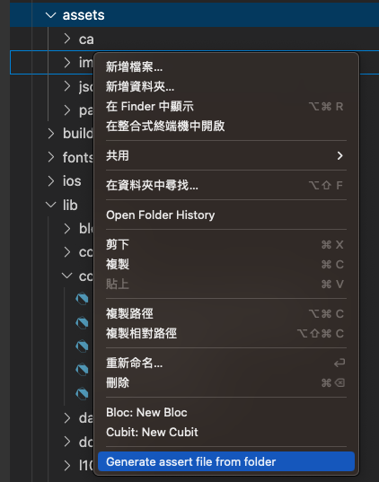
* Svg template
```dart
import 'package:flutter/material.dart';
import 'package:flutter_svg/flutter_svg.dart';
enum SvgIcon {
  applePay('assets/images/apple_pay.svg'),
  final String path;
  const SvgIcon(this.path);
  
  Widget toIcon({double? width, double? height,Color? color}) => SvgPicture.asset(
    path,
    width: width,
    height: height,
    color:color
  );
}
```
* How to Use 

```dart
SvgIcon.applePay.toIcon(width: 20,height: 20,color: Colors.red)
```

* Png template

```dart
import 'package:flutter/material.dart';
  
enum PngImage {
  googlePay('assets/images/google_pay.png'),

  final String path;
  const PngImage(this.path);
  
  Widget toImage({
    double? width,
    double? height,
    Color? color,
    ImageFrameBuilder? frameBuilder,
    ImageErrorWidgetBuilder? errorBuilder,
    String? semanticLabel,
    bool excludeFromSemantics = false,
    double? scale,
    BlendMode? colorBlendMode,
    BoxFit? fit,
    AlignmentGeometry alignment = Alignment.center,
    ImageRepeat repeat = ImageRepeat.noRepeat,
    Rect? centerSlice,
    bool matchTextDirection = false,
    bool gaplessPlayback = false,
    bool isAntiAlias = false,
    String? package,
    FilterQuality filterQuality = FilterQuality.low,
    int? cacheWidth,
    int? cacheHeight,
  }) =>
      Image.asset(
        path,
        width: width,
        height: height,
        color: color,
        frameBuilder: frameBuilder,
        errorBuilder: errorBuilder,
        semanticLabel: semanticLabel,
        excludeFromSemantics: excludeFromSemantics,
        scale: scale,
        colorBlendMode: colorBlendMode,
        fit: fit,
        alignment: alignment,
        repeat: repeat,
        centerSlice: centerSlice,
        matchTextDirection: matchTextDirection,
        gaplessPlayback: gaplessPlayback,
        isAntiAlias: isAntiAlias,
        package: package,
        filterQuality: filterQuality,
        cacheWidth: cacheWidth,
        cacheHeight: cacheHeight,
      );
}
```
* How to Use 

```dart
PngImage.googlePay.toImage(width: 20,height: 20,color: Colors.red)
```

### QuickFix part of
* Use quick fix to add "part of" or "part of "

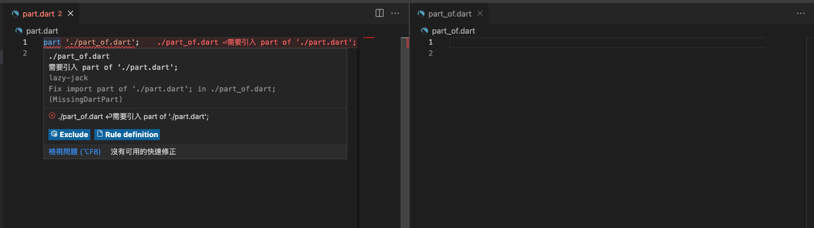
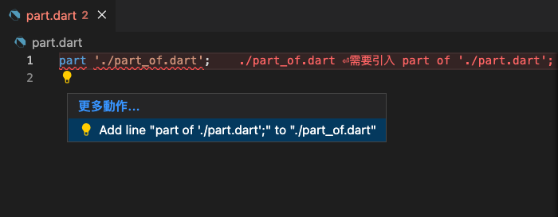
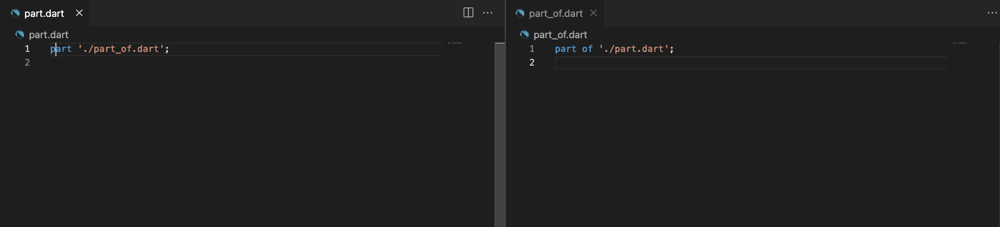

### Freezed
* Freezed auto import
  * After input "@freezed" will auto import
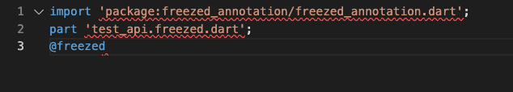

* Freezed extension action
  * Show when cursor on class Line
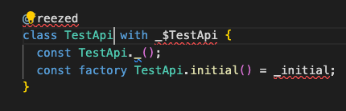
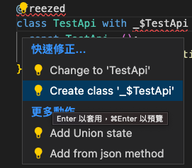
* Freezed from json method

  * put cursor on from json method will Auto add "part baseFileName.g.dart"
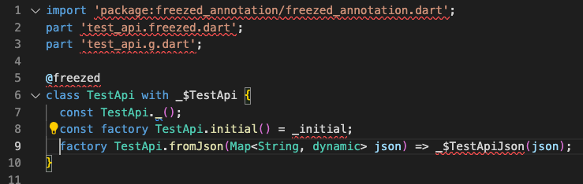

* Freezed union create
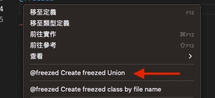

* Freezed add union state
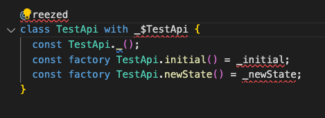


* Json to freezed
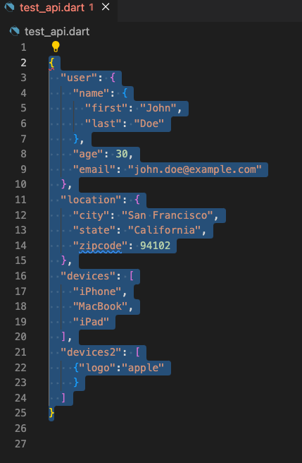
  * Menu
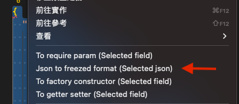
  * Fix Action
	  * !! Show Only Json format!!
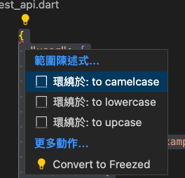
  * Convert to freezed Result
    ```dart 
    import 'package:freezed_annotation/freezed_annotation.dart';
    part 'test_api.g.dart';
    part 'test_api.freezed.dart';

    @freezed
    class TestApi with _$TestApi {
      const TestApi._();
      const factory TestApi({
        final User? user,
        final Location? location,
        @Default([]) final List<String> devices,
        @Default([]) final List<Devices2> devices2,
      }) = _TestApi;
      factory TestApi.fromJson(Map<String, dynamic> json) =>
          _$TestApiFromJson(json);
    }

    @freezed
    class Devices2 with _$Devices2 {
      const Devices2._();
      const factory Devices2({
        final String? logo,
      }) = _Devices2;
      factory Devices2.fromJson(Map<String, dynamic> json) =>
          _$Devices2FromJson(json);
    }

    @freezed
    class Location with _$Location {
      const Location._();
      const factory Location({
        final String? city,
        final String? state,
        final int? zipcode,
      }) = _Location;
      factory Location.fromJson(Map<String, dynamic> json) =>
          _$LocationFromJson(json);
    }

    @freezed
    class User with _$User {
      const User._();
      const factory User({
        final Name? name,
        final int? age,
        final String? email,
      }) = _User;
      factory User.fromJson(Map<String, dynamic> json) => _$UserFromJson(json);
    }

    @freezed
    class Name with _$Name {
      const Name._();
      const factory Name({
        final String? first,
        final String? last,
      }) = _Name;
      factory Name.fromJson(Map<String, dynamic> json) => _$NameFromJson(json);
    }


    ```
 

 ###  Class to factory (dev)

* Select text

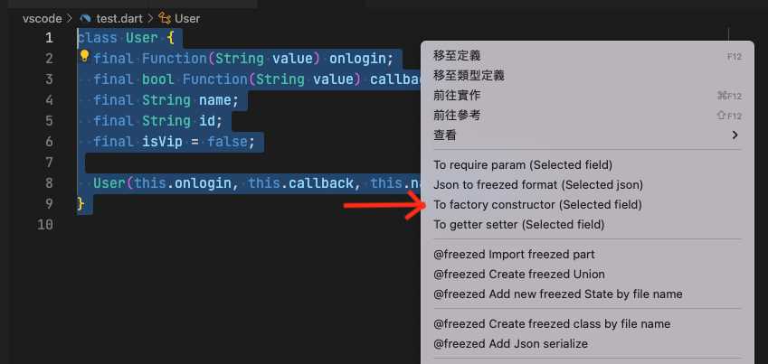
* Enter name

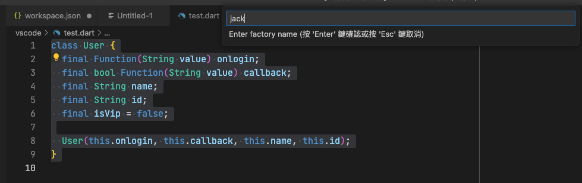
* Finish

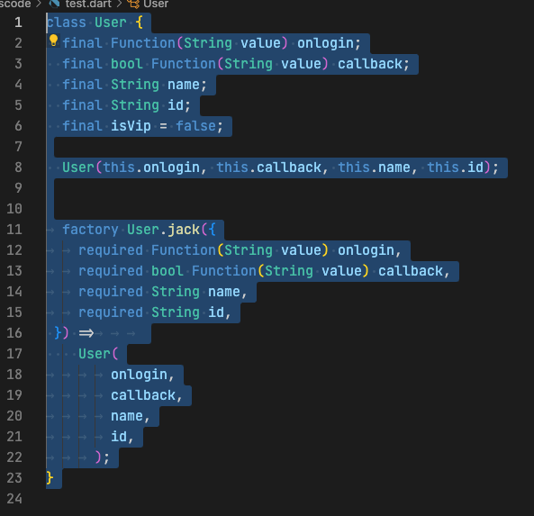

## Support
* [Snippets Menu](./doc/snippets.md)
* [Right click Menu](./doc/menu_right_click.md)


## SideBar GUI

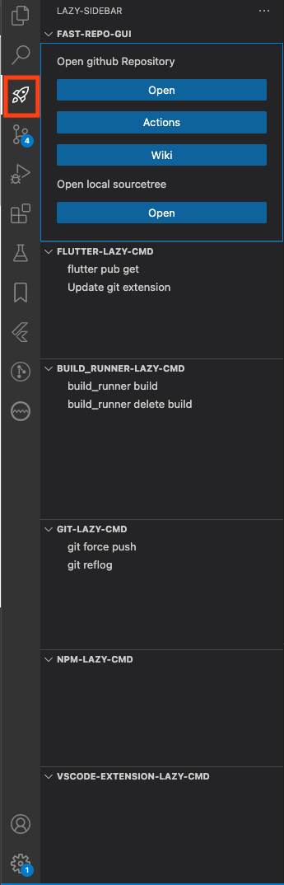


