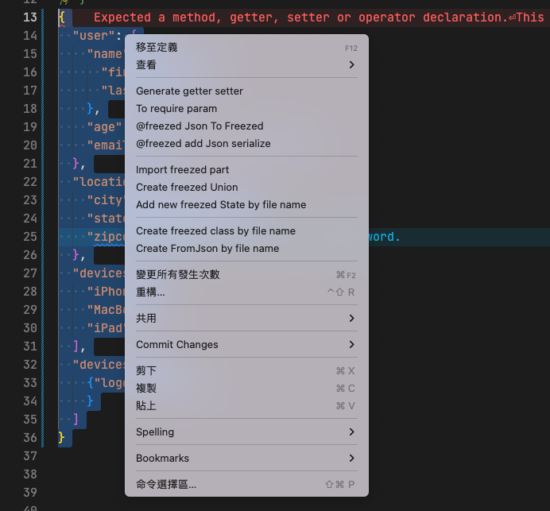

#### Right click menu


|  Menu   |  Description  | Supplement| Support|
|  ----  | ----  |------|-----|
|Generate getter setter|||dart,onText Selected|
|To require param| ||dart,onText Selected|
|@json to Freezed|convert selected json to freezed code ||dart, onText Selected|
|@freezed add json serialize| Find all @freezed class in file and add factory fromJson if not implement||dart|
|  ----  | ----  |------|-----|
|Import freezed part| ||dart |
|Create freezed Union| ||dart |
|Add new freezed State by file name| ||dart |
|  ----  | ----  |------|-----|
|Add new freezed State by file name| ||dart |
|Create FromJson by file name| ||dart |

* Generate getter setter

```dart
class Sample {
  bool open;
  //  selected 'bool open' => right click menu Generate getter setter
  //  auto Generate getter setter
  bool get getOpen => this.open;
  set setOpen(bool open) => this.open = open;
  Sample(this.open);
}

```

* To require param

```dart
class Sample {
  Sample(this.open, bool close);
  //  selected 'this.open' => right click menu To require param
  >> Sample({required this.open, required  bool close, });

}

```