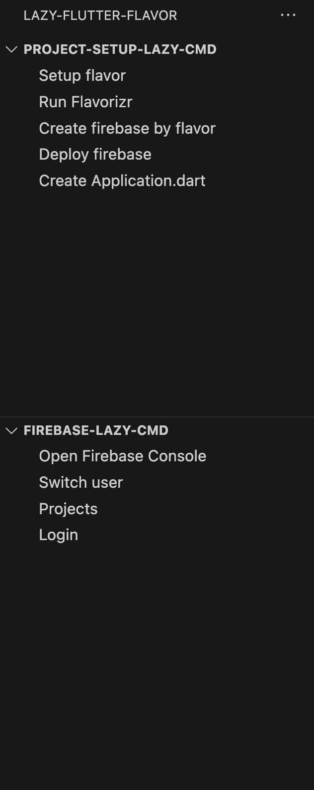

## Fast to setup Flavor to new project 
### UI to setup project and connect to firebase
* Decencies Cli
    * [firebase] (https://firebase.google.com/docs/cli)
        * setup
       
            ```

            npm install -g firebase-tools
            ```

    * [flutter fire](https://firebase.flutter.dev/docs/cli/)
         * setup
            ```
            npm install -g firebase-tools

            dart pub global activate flutterfire_cli
            ```

* Setup flavor / Run Flavorizr
    * Decencies
        * [flutter_flavorizr](https://pub.dev/packages/flutter_flavorizr)
    * If create failed use Run Flavorizr to recreate

* Create firebase by flavor
    * If you already have firebase project, you can skip this step
    * goal => set flavor is one-to-one with firebase

* Deploy firebase
    * goal => deploy firebase by flavor 
    * auto setup in android and ios by flavor
    * no need to manually download google-service.json and GoogleService-Info.plist anymore
    * will create firebase option at lib/firebase_options
    
* Create Application.dart
    * maintain flavor with  Application template

